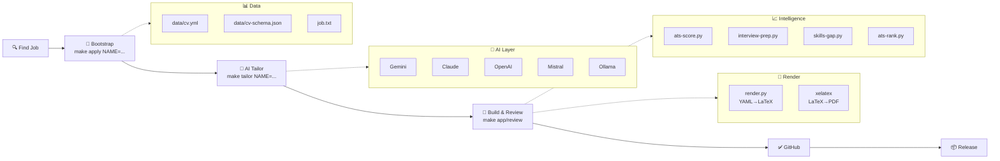

# 📄 CV Pipeline

[](https://www.python.org/downloads/)
[](LICENSE)
[](tests/)

AI-powered CV and cover letter automation. YAML source of truth, multi-provider AI tailoring, rendered to PDF via LaTeX. Includes ATS scoring, interview prep, LinkedIn sync, and batch application workflows.

---

## 🎯 Overview

CV Pipeline transforms job searching into a streamlined, data-driven process. Define your background once in YAML, then:

1. **AI-Tailor** for each job (Gemini, Claude, OpenAI, Mistral, or Ollama)
2. **Render** to LaTeX with automatic escaping
3. **Build** production PDFs with XeLaTeX
4. **Score** against job descriptions with ATS keyword analysis
5. **Release** to GitHub with automated CI/CD

**One command to rule them all:**
```bash
make tailor NAME=2026-03-acme AI=gemini   # AI-powered tailoring
make app NAME=2026-03-acme                # Compile + validate
make review NAME=2026-03-acme             # Full review pipeline
```

---

## 🔄 Workflow Diagram



---

## 🏗️ Architecture

### Data Pipeline

```
data/cv.yml (YAML source of truth)
    ↓
[scripts/render.py] (YAML→LaTeX converter)
    ├─ Automatic escaping of LaTeX special chars (&, %, $, #, _, ~, ^, \)
    ├─ Markdown bold conversion: **text** → \textbf{text}
    └─ Per-section rendering logic
    ↓
CV.tex (Generated LaTeX)
    ↓
[xelatex] (LaTeX→PDF compiler)
    ↓
CV.pdf (Production PDF)
```

### Design Philosophy

| Principle | Implementation |
|-----------|-----------------|
| **Single Source of Truth** | YAML only (no LaTeX in data) |
| **AI Outputs YAML** | LLMs generate YAML, render.py handles escaping |
| **Automatic Escaping** | LaTeX special chars never need manual escaping |
| **Schema Validation** | JSON Schema enforces cv.yml structure |
| **2-Page Limit** | CI/CD enforces page count constraints |

---

## 🚀 Quick Start

### Prerequisites

- Python 3.8+
- XeLaTeX (included with TexLive 2025 or later)
- Git
- Make
- pyyaml (`pip install pyyaml`)

### Clone & Setup

```bash
git clone https://github.com/jsoyer/cv-pipeline.git
cd cv-pipeline

# Optional: Create virtual environment
python3 -m venv venv
source venv/bin/activate

# Install dependencies
pip install -r requirements.txt

# Validate setup
make doctor
```

### Build Your Master CV

```bash
# Render YAML → LaTeX
make render

# Compile to PDF
make all

# Build and open in Preview (macOS) or default viewer
make open
```

### Tailor for a Job

```bash
# Step 1: Create application (bootstrap files)
make apply URL="https://example.com/job-posting"

# Step 2: Tailor CV + cover letter with AI
make tailor NAME=2026-03-acme [AI=gemini|claude|openai|mistral|ollama]

# Step 3: Build PDFs and validate
make app NAME=2026-03-acme

# Step 4: Full review (render + compile + validate + ATS score)
make review NAME=2026-03-acme
```

---

## 🧠 AI Providers

Choose your LLM with the `AI=` flag. Each provider auto-selects a default model; override with `MODEL=`.

| Provider | Env Variable | Default Model | Fallback | Speed | Cost |
|----------|--------------|---------------|----------|-------|------|
| **Gemini** | `GEMINI_API_KEY` | gemini-2.5-flash | gemini-2.0-flash-lite | ⚡⚡⚡ | $ |
| **Claude** | `ANTHROPIC_API_KEY` | claude-sonnet-4-6 | claude-haiku-4-5 | ⚡⚡ | $$ |
| **OpenAI** | `OPENAI_API_KEY` | gpt-4o | gpt-4o-mini | ⚡⚡ | $$ |
| **Mistral** | `MISTRAL_API_KEY` | mistral-large-latest | mistral-small-latest | ⚡ | $ |
| **Ollama** | (local) | configurable | — | ⚡⚡⚡ (local) | Free |

### Example: Custom Model

```bash
# Use Claude Opus instead of default Sonnet
make tailor NAME=2026-03-acme AI=claude MODEL=claude-opus-4-6

# Use Ollama with custom model
make tailor NAME=2026-03-acme AI=ollama OLLAMA_MODEL=mistral-7b
```

### Setup API Keys

Create `.env` file in repo root:

```bash
GEMINI_API_KEY=your-key-here
ANTHROPIC_API_KEY=your-key-here
OPENAI_API_KEY=your-key-here
MISTRAL_API_KEY=your-key-here
OLLAMA_HOST=http://localhost:11434
OLLAMA_MODEL=mistral-7b
```

Or set them as environment variables:
```bash
export GEMINI_API_KEY=...
export ANTHROPIC_API_KEY=...
```

---

## 📚 Scripts Reference

### 🔧 Core Rendering & Compilation (4 scripts)

| Script | Make Target | Description |
|--------|------------|-------------|
| `render.py` | `make render` | YAML→LaTeX renderer with automatic escaping |
| `ai-tailor.py` | `make tailor NAME=...` | Multi-provider AI tailoring with ATS comparison |
| `fetch-job.py` | `make fetch NAME=...` | Download job descriptions from URL |
| `doctor.py` | `make doctor` | Health check: verify dependencies, XeLaTeX, fonts |

### 📊 Intelligence & Scoring (6 scripts)

| Script | Make Target | Description |
|--------|------------|-------------|
| `ats-score.py` | `make score NAME=...` | ATS keyword scoring with section weighting |
| `interview-prep.py` | `make prep NAME=...` | Generate interview prep notes from CV + job |
| `skills-gap.py` | `make skills NAME=...` | Analyze missing skills across job postings |
| `ats-rank.py` | `make ats-rank NAME=...` | Rank keywords by frequency and impact |
| `job-fit.py` | `make job-fit NAME=...` | Analyze job match score and fit |
| `effectiveness.py` | `make effectiveness` | Correlation analysis: outcome vs ATS score |

### ✨ CV Tailoring & Optimization (5 scripts)

| Script | Make Target | Description |
|--------|------------|-------------|
| `cv-health.py` | `make cv-health` | CV health checks: length, readability, gaps |
| `length-optimizer.py` | `make length` | Analyze content density and fit-to-2-pages |
| `changelog.py` | `make changelog NAME=...` | Show CV changes across applications |
| `cv-versions.py` | `make cv-versions` | Track all CV versions across applications |
| `cv-keywords.py` | `make cv-keywords` | Extract and analyze keywords by section |

### 💼 Interview Preparation (6 scripts)

| Script | Make Target | Description |
|--------|------------|-------------|
| `interview-prep.py` | `make prep NAME=...` | Generate interview brief: company, role, talking points |
| `interview-brief.py` | `make interview-brief NAME=...` | Pre-interview checklist and strategy |
| `interview-debrief.py` | `make interview-debrief NAME=...` | Post-interview reflection guide |
| `interview-sim.py` | `make interview-sim NAME=...` | Interactive interview simulation |
| `question-bank.py` | `make question-bank` | Generate common interview Q&A database |
| `prep-quiz.py` | `make prep-quiz NAME=...` | Self-test on company/role knowledge |

### 🤝 Outreach & Networking (7 scripts)

| Script | Make Target | Description |
|--------|------------|-------------|
| `followup.py` | `make followup NAME=...` | Generate follow-up email templates |
| `recruiter-email.py` | `make recruiter-email NAME=...` | Craft recruiter outreach emails |
| `linkedin-message.py` | `make linkedin-message NAME=...` | Generate LinkedIn connection messages |
| `thankyou.py` | `make thankyou NAME=...` | Thank-you email after interview |
| `negotiate.py` | `make negotiate NAME=...` | Salary negotiation talking points |
| `network-map.py` | `make network-map NAME=...` | Analyze your network for this company |
| `milestone.py` | `make milestone` | Career milestone tracker and reflection |

### 📈 Reporting & Analytics (11 scripts)

| Script | Make Target | Description |
|--------|------------|-------------|
| `report.py` | `make report` | Application funnel dashboard (YAML format) |
| `stats.py` | `make stats` | Application statistics and metrics (JSON) |
| `apply-board.py` | `make apply-board` | Kanban-style application board |
| `timeline.py` | `make timeline` | Mermaid Gantt chart of applications |
| `deadline-alert.py` | `make deadline-alert` | Alert for approaching deadlines |
| `digest.py` | `make digest` | Weekly application digest |
| `ats-text.py` | `make ats-text` | Plain-text ATS-friendly CV version |
| `salary-bench.py` | `make salary-bench` | Salary benchmarking across postings |
| `keyword-trends.py` | `make trends` | Trending keywords across job postings |
| `company-research.py` | `make research NAME=...` | Company background and culture research |
| `generate-dashboard.py` | `make dashboard` | Interactive HTML application dashboard |

### 📱 LinkedIn & Social (4 scripts)

| Script | Make Target | Description |
|--------|------------|-------------|
| `linkedin-sync.py` | `make linkedin` | Sync CV to LinkedIn profile |
| `linkedin-post.py` | `make linkedin-post NAME=...` | Generate LinkedIn post for application |
| `linkedin-profile.py` | `make linkedin-profile` | Validate LinkedIn profile completeness |
| `elevator-pitch.py` | `make elevator-pitch` | Generate 30-second elevator pitch |

### 💾 Export & Integration (5 scripts)

| Script | Make Target | Description |
|--------|------------|-------------|
| `export.py` | `make export` | Export CV to JSON/Markdown/plain text |
| `json-resume.py` | `make json-resume` | Generate JSON Resume v1.0 format |
| `export-csv.py` | `make export-csv` | Export application history as CSV |
| `batch-apply.py` | `make batch NAME=...` | Batch tailor + build multiple applications |
| `watch.py` | `make watch` | Watch mode for auto-rebuild on changes |

### 🔍 Discovery & Analysis (5 scripts)

| Script | Make Target | Description |
|--------|------------|-------------|
| `blind-spots.py` | `make blind-spots` | Identify skill/experience blind spots |
| `competitor-map.py` | `make competitor-map` | Analyze competitors' skills and positioning |
| `cover-angles.py` | `make cover-angles NAME=...` | Generate multiple cover letter angles |
| `cover-critique.py` | `make cover-critique NAME=...` | AI critique of cover letter strength |
| `tone-check.py` | `make tone-check NAME=...` | Analyze writing tone (professional, engaging) |

### 🎯 Specialized (7 scripts)

| Script | Make Target | Description |
|--------|------------|-------------|
| `match.py` | `make match NAME=...` | Reverse ATS: how well does CV match job? |
| `visual-diff.py` | `make visual-diff` | PDF visual regression testing |
| `url-check.py` | `make url-check` | Validate all URLs in CV/cover letter |
| `references.py` | `make references` | Reference management and contact tracking |
| `contacts.py` | `make contacts` | Contact database for companies |
| `onboarding-plan.py` | `make onboarding-plan NAME=...` | 30-60-90 day onboarding plan |
| `cv-fr-tailor.py` | `make cv-fr-tailor NAME=...` | Tailor French CV version (if available) |

**Total: 67 Python scripts + shared library**

---

## 📦 Shared Library

All scripts inherit from `scripts/lib/` for consistent behavior:

### 🧠 `lib/ai.py` — Multi-Provider LLM Interface

Unified interface to 5 AI providers with automatic fallback models:

```python
from lib.ai import call_ai, VALID_PROVIDERS

# Supports: gemini, claude, openai, mistral, ollama
text = call_ai(prompt, provider="gemini", api_key=os.getenv("GEMINI_API_KEY"))
text = call_ai(prompt, provider="claude", model="claude-opus-4-6")
text = call_ai(prompt, provider="ollama", model="mistral-7b")
```

**Exports:**
- `call_ai(prompt, provider, api_key=None, model=None, temperature=0.7, timeout=60)`
- `call_gemini()`, `call_claude()`, `call_openai_compat()`, `call_ollama()` (low-level)
- `VALID_PROVIDERS = ["gemini", "claude", "openai", "mistral", "ollama"]`
- `PROVIDER_MODELS = {"gemini": "gemini-2.5-flash", "claude": "claude-sonnet-4-6", ...}`

### 🛠️ `lib/common.py` — Utilities & Helpers

Shared functions for all scripts:

```python
from lib.common import (
    load_env,
    load_meta,
    require_yaml,
    company_from_dirname,
    setup_logging,
    REPO_ROOT,
    SCRIPTS_DIR,
)

# Load environment
env = load_env()  # Dict of all .env variables

# Setup logging
log = setup_logging(verbose=True)

# Parse application metadata
meta = load_meta("applications/2026-03-acme")
print(meta["company"], meta["position"], meta["created"])
```

**Exports:**
- `load_env()` — Parse `.env` file
- `load_meta(app_dir)` — Load application `meta.yml`
- `require_yaml()` — Validate pyyaml is installed
- `company_from_dirname(path)` — Extract company name from app dirname
- `setup_logging(verbose=False)` — Structured logging with timestamps
- Constants: `REPO_ROOT`, `SCRIPTS_DIR`, `USER_AGENT`, `TIMEOUT_*`

---

## ⚙️ GitHub Actions (14 Workflows)

Automated CI/CD on every push/PR:

| Workflow | Trigger | Description |
|----------|---------|-------------|
| **build.yml** | Push to main | Compile CV + CoverLetter, spell check, validate pages, upload artifacts |
| **pr-preview.yml** | PR opened | Generate PDF previews with DRAFT watermark, ATS comparison (master vs tailored) |
| **release.yml** | Merge apply/* | Create GitHub Release with PDFs |
| **notion-sync.yml** | PR merge | Auto-create/update Notion tracker entries |
| **update-submodule.yml** | Weekly schedule | Check awesome-cv submodule for updates |
| **follow-up.yml** | Weekly schedule | Remind on stale applications (>14 days), alert on approaching deadlines |
| **notify.yml** | PR merge, CI fail | Send Slack/Discord/Telegram notifications |
| **auto-archive.yml** | Monthly schedule | Archive stale merged PRs (>30 days old) |
| **auto-apply.yml** | PR labeled | Automatically tailor + build when labeled "ready-to-apply" |
| **interview-reminder.yml** | Schedule | D+7 follow-ups for scheduled interviews |
| **cv-health-check.yml** | Push to main | CV completeness, skill gaps, readability analysis |
| **linkedin-sync.yml** | Schedule | Sync CV updates to LinkedIn profile |
| **update-website.yml** | Merge to main | Deploy CV to personal website |
| **dashboard.yml** | Schedule | Generate interactive application dashboard |

---

## 🧪 Testing

### Run All Tests

```bash
# Run pytest suite
pytest tests/ -v

# With coverage
pytest tests/ --cov=scripts --cov-report=html

# Specific test file
pytest tests/test_render.py -v

# Specific test class/method
pytest tests/test_render.py::TestEscapeLatex -v
```

### Test Coverage

**99 tests passing** across 3 modules:

| Module | Tests | Coverage | Focus |
|--------|-------|----------|-------|
| **test_render.py** | 45 | LaTeX escaping, markdown conversion, section rendering |
| **test_ai.py** | 32 | Provider detection, prompt templates, error handling |
| **test_common.py** | 22 | YAML loading, environment parsing, logging setup |

### Example Test Output

```
tests/test_render.py::TestEscapeLatex::test_ampersand PASSED
tests/test_render.py::TestEscapeLatex::test_percent PASSED
tests/test_render.py::TestMdBoldToLatex::test_simple_bold PASSED
tests/test_ai.py::TestProviderDetection::test_valid_providers PASSED
tests/test_common.py::TestLoadEnv::test_missing_env_file PASSED

======================== 99 passed in 2.34s ========================
```

---

## 🔨 Makefile Reference

### 🎯 Core Commands

| Target | Description | Example |
|--------|-------------|---------|
| `all` | Build master CV + CoverLetter | `make all` |
| `open [NAME=...]` | Build + open PDFs | `make open` / `make open NAME=2026-03-acme` |
| `render [LANG=...]` | Render YAML→LaTeX | `make render` / `make render LANG=fr` |
| `app NAME=...` | Build specific application | `make app NAME=2026-03-acme` |
| `check` | Validate YAML, lint, check placeholders | `make check` |

### 🔄 Workflow Commands

| Target | Description |
|--------|-------------|
| `apply [URL=...] [COMPANY=...] [POSITION=...]` | Bootstrap new application |
| `tailor NAME=... [AI=...] [TARGET=...]` | AI tailor CV/CoverLetter |
| `fetch NAME=...` | Download job description |
| `review NAME=...` | Full pipeline: render + compile + validate + ATS |
| `pipeline [NAME=...] [AI=...]` | Alias for `tailor` + `review` |

### 📊 Intelligence & Analysis

| Target | Description |
|--------|-------------|
| `score NAME=...` | ATS keyword score |
| `ats-rank NAME=...` | Rank keywords by impact |
| `job-fit NAME=...` | Job match analysis |
| `skills NAME=...` | Skills gap analysis |
| `effectiveness` | Outcome vs ATS correlation |
| `prep NAME=...` | Generate interview prep notes |
| `cv-health` | CV health checks |
| `trends` | Keyword trends across postings |

### 📈 Reporting

| Target | Description |
|--------|-------------|
| `report` | Application funnel dashboard |
| `stats` | Statistics and metrics (JSON) |
| `apply-board` | Kanban-style board |
| `timeline` | Gantt chart (Mermaid) |
| `digest` | Weekly digest |
| `dashboard` | Interactive HTML dashboard |

### 💾 Export & Integration

| Target | Description |
|--------|-------------|
| `export` | Export CV to JSON/Markdown |
| `json-resume` | JSON Resume format |
| `export-csv` | Export as CSV |
| `linkedin` | Sync to LinkedIn |
| `batch NAME=...` | Batch tailor + build |
| `watch` | Auto-rebuild on changes |

### 🛠️ Utilities

| Target | Description |
|--------|-------------|
| `doctor` | Verify dependencies |
| `help` | Show all targets with descriptions |
| `clean` | Remove generated PDFs |
| `archive-app NAME=...` | Archive old application |

---

## 🛠️ Tech Stack

| Component | Technology | Version |
|-----------|-----------|---------|
| **Data Format** | YAML | (pyyaml 5.4+) |
| **Schema Validation** | JSON Schema | draft-2020-12 |
| **Rendering** | Python | 3.8+ |
| **Template Engine** | Awesome-CV | (custom submodule) |
| **LaTeX Compiler** | XeLaTeX | TexLive 2025 |
| **Font Support** | Fontawesome6 | (auto-installed) |
| **Testing** | pytest | 7.0+ |
| **Linting** | (optional) | pylint, black, flake8 |
| **CI/CD** | GitHub Actions | (14 workflows) |
| **Version Control** | Git | 2.30+ |
| **Makefile** | GNU Make | 4.0+ |

---

## 📄 File Layout

```
cv-pipeline/
├── data/
│   ├── cv.yml                    # YAML source of truth
│   ├── cv-fr.yml                 # French version (optional)
│   ├── coverletter.yml           # Cover letter template
│   └── cv-schema.json            # JSON Schema for validation
├── scripts/
│   ├── lib/
│   │   ├── __init__.py
│   │   ├── ai.py                 # Multi-provider LLM interface
│   │   └── common.py             # Shared utilities
│   ├── render.py                 # YAML→LaTeX (core)
│   ├── ai-tailor.py              # AI tailoring orchestrator
│   ├── ats-score.py              # ATS keyword scoring
│   ├── interview-prep.py         # Interview preparation
│   ├── [62 more scripts...]      # See Scripts Reference
│   └── fetch-job.py              # Download job descriptions
├── tests/
│   ├── conftest.py               # pytest configuration
│   ├── test_render.py            # 45 tests
│   ├── test_ai.py                # 32 tests
│   └── test_common.py            # 22 tests
├── awesome-cv/                   # LaTeX template (submodule)
│   ├── awesome-cv.cls
│   ├── fonts/
│   └── ...
├── applications/
│   └── 2026-03-acme/             # Each application folder
│       ├── meta.yml              # Metadata & outcome
│       ├── job.txt               # Job description
│       ├── CV - Company - Role.tex
│       ├── CV - Company - Role.pdf
│       ├── CoverLetter - Company - Role.tex
│       ├── CoverLetter - Company - Role.pdf
│       ├── cv-tailored.yml       # (if tailored)
│       └── coverletter.yml       # (if tailored)
├── Makefile                      # ~83 targets
├── requirements.txt              # Python dependencies
├── .env.example                  # Environment variables template
├── .github/workflows/            # 14 GitHub Actions
└── README.md                     # This file
```

---

## 🎓 Common Workflows

### 📝 One-Off Application

```bash
# Find job online, get URL
URL="https://example.com/job-posting"

# Bootstrap (creates application/, branch, PR)
make apply URL="$URL"

# Tailor for this job (ai-tailor + render)
make tailor NAME=2026-03-acme AI=gemini

# Build + validate
make app NAME=2026-03-acme

# Full review (render + compile + validate + ATS)
make review NAME=2026-03-acme

# Ready to submit
git push && gh pr ready
```

### 🚀 Batch Targeting (10+ similar roles)

```bash
# Create applications for multiple jobs
make apply URL="https://example1.com/job" COMPANY="Acme" POSITION="Senior Engineer"
make apply URL="https://example2.com/job" COMPANY="Beta Corp" POSITION="Principal Engineer"

# Batch tailor all with Mistral (fastest)
make batch AI=mistral

# Review all
for dir in applications/*/; do
  make review NAME=$(basename "$dir")
done
```

### 🎤 Prepare for Interview

```bash
# Generate interview brief
make interview-brief NAME=2026-03-acme

# Company research
make research NAME=2026-03-acme

# Practice Q&A
make prep-quiz NAME=2026-03-acme

# Mock interview
make interview-sim NAME=2026-03-acme
```

### 📊 Track Progress

```bash
# Weekly digest
make digest

# Application dashboard
make dashboard

# Effectiveness analysis
make effectiveness

# Salary benchmarking
make salary-bench
```

---

## 🔐 Privacy & Safety

This public repository contains **only templates and tooling**, not personal data:

- ✅ `data/cv.yml` → Git-ignored example only (your real CV stays private)
- ✅ `applications/` → Git-ignored (applications are confidential)
- ✅ `.env` → Git-ignored (API keys never committed)
- ✅ `*.pdf` → Git-ignored (PDFs stay local)

The code is 100% safe to fork and customize for your own use.

---

## 📝 License

### Tooling (Scripts, Makefile)
**MIT License** — Free to use, modify, and distribute.

### LaTeX Template (awesome-cv)
**CC BY-SA 4.0** — [Original by Jan Küster](https://github.com/posquit0/Awesome-CV), modified for this pipeline.

See [LICENSE](LICENSE) and [awesome-cv/LICENCE](awesome-cv/LICENCE) for full details.

---

## 🤝 Contributing

Found a bug or have a feature request? Open an issue or submit a pull request!

```bash
# Development setup
git clone https://github.com/jsoyer/cv-pipeline.git
cd cv-pipeline
python3 -m venv venv
source venv/bin/activate
pip install -r requirements.txt

# Run tests
pytest tests/ -v

# Make your changes
git checkout -b feature/my-improvement
git commit -am "feat: add feature"
git push origin feature/my-improvement
```

---

## 📖 Documentation

- **Full CLAUDE.md** — Project context, conventions, known issues
- **Makefile targets** — `make help` for full reference
- **Script docstrings** — Each script documents its usage in the shebang
- **examples/** — Example YAML, LaTeX templates, outputs

---

## ⚡ Quick Reference

```bash
# Master CV
make render                      # YAML→LaTeX
make all                         # Compile master CV + CL
make open                        # Build + open

# New Application
make apply URL="..."             # Bootstrap
make tailor NAME=... AI=gemini   # Tailor
make app NAME=...                # Build
make review NAME=...             # Full check

# Intelligence
make score NAME=...              # ATS score
make prep NAME=...               # Interview prep
make research NAME=...           # Company research
make job-fit NAME=...            # Job match

# Reporting
make report                      # Funnel dashboard
make stats                       # Metrics
make timeline                    # Gantt chart
make digest                      # Weekly summary

# Export
make export                      # JSON/Markdown
make export-csv                  # Spreadsheet
make linkedin                    # LinkedIn sync
make json-resume                 # JSON Resume format

# Utilities
make doctor                      # Health check
make help                        # All targets
make watch                       # Auto-rebuild
```

---

## 🌟 What Makes This Special

1. **Multi-Provider AI** — Choose Gemini (fast/cheap), Claude (smart), OpenAI (standard), Mistral (open), or Ollama (local)
2. **YAML Source of Truth** — Never write LaTeX directly; AI outputs YAML
3. **Automatic Escaping** — No more LaTeX special-character nightmares
4. **ATS Intelligence** — Real-time scoring, keyword gap analysis, trending insights
5. **Interview Prep** — Auto-generated briefs, Q&A banks, mock interviews
6. **Batch Workflows** — Tailor 10+ applications in minutes
7. **GitHub-Native** — Draft PRs, auto-release, notified on outcomes
8. **99 Tests** — Reliable rendering, AI handling, data parsing
9. **Extensible** — 67 scripts, modular design, inherit from shared lib
10. **Job Search Analytics** — Track effectiveness, correlate outcomes with ATS scores

---

## 🐛 Troubleshooting

### Common Issues

**Q: `xelatex: command not found`**
```bash
# Install TexLive 2025
brew install --cask mactex
# or: tlmgr install fontawesome6
```

**Q: `pyyaml` not found**
```bash
pip install -r requirements.txt
# or: pip install pyyaml
```

**Q: CV is >2 pages**
```bash
make length              # Analyze density
make cv-health           # Check for bloat
# Trim or make tailor adjustments
```

**Q: ATS score dropped after tailoring**
```bash
# Compare before/after keywords
make ats-rank NAME=...
make cv-keywords NAME=...
# Adjust tailor prompt in scripts/ai-tailor.py
```

**Q: API key not recognized**
```bash
# Verify .env is loaded
make doctor

# Test provider manually
python3 -c "from lib.ai import call_ai; print(call_ai('test', 'gemini', os.getenv('GEMINI_API_KEY')))"
```

See full `CLAUDE.md` for known issues and platform-specific workarounds.

---

## 📊 Stats

- **67** Python scripts (+ shared lib)
- **83+** Makefile targets
- **14** GitHub Actions workflows
- **99** passing unit tests
- **2** YAML formats (English + French)
- **5** AI provider integrations
- **4** export formats (YAML, JSON, Markdown, CSV)
- **~2,500** lines of documented Python code
- **1** source of truth (data/cv.yml)

---

## 🎯 Next Steps

1. **Clone** this repo and customize `data/cv.yml`
2. **Setup** `.env` with your API keys
3. **Validate** with `make doctor`
4. **Find a job** online
5. **Bootstrap** with `make apply URL=...`
6. **Tailor** with `make tailor NAME=... AI=gemini`
7. **Review** with `make review NAME=...`
8. **Submit** with confidence

Good luck with your job search! 🚀

---

**Made with care for engineers, designers, and career-minded professionals.**
