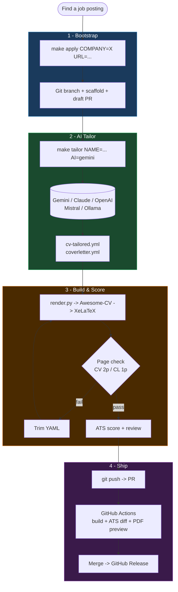

# 📄 CV Pipeline

> **An AI-powered job application engine built on [Awesome-CV](https://github.com/posquit0/Awesome-CV).**
> From YAML to tailored PDF in one command. Used in production to apply at Anthropic.

[](https://www.python.org/downloads/)
[](LICENSE)
[](tests/)
[](https://github.com/posquit0/Awesome-CV)
[](#-ai-providers)

### Sample Output (Awesome-CV)

<p align="center">
  <a href="docs/sample-cv.pdf">
    
  </a>
</p>

<p align="center">
  <a href="docs/sample-cv.pdf"><strong>View Sample CV (PDF)</strong></a> &nbsp;|&nbsp;
  <a href="docs/sample-coverletter.pdf"><strong>View Sample Cover Letter (PDF)</strong></a>
</p>

---

## Why This Exists

Job searching is repetitive, error-prone, and time-consuming. You write the same CV in slightly different ways, manually tweak cover letters, forget to follow up, and have no idea if your keywords even match the job description.

**CV Pipeline automates the entire process.** Write your background once in YAML. For each job, AI tailors your CV and cover letter, the system scores it against ATS keywords, renders production-quality PDFs via [Awesome-CV](https://github.com/posquit0/Awesome-CV) + XeLaTeX, and GitHub Actions handles CI/CD, releases, and reminders.

I built this for my own job search and used it to apply at **Anthropic** — the company behind Claude. The pipeline handled everything from initial tailoring to interview prep.

---

## How It Works

```
data/cv.yml + job.txt
       |
       v
   AI Provider (Gemini / Claude / OpenAI / Mistral / Ollama)
       |
       v
   cv-tailored.yml + coverletter.yml
       |
       v
   render.py (YAML -> LaTeX, auto-escaping, **bold** -> \textbf{})
       |
       v
   Awesome-CV template (awesome-cv.cls + XeLaTeX)
       |
       v
   Production PDF (CV + Cover Letter)
```



---

## Key Features

| Feature | What it does |
|---------|-------------|
| **[Awesome-CV](https://github.com/posquit0/Awesome-CV) rendering** | Beautiful, professional PDFs via the most popular LaTeX CV template (20k+ stars) |
| **5 AI providers** | Gemini, Claude, OpenAI, Mistral, Ollama — swap with `AI=` flag |
| **YAML source of truth** | No LaTeX editing. AI outputs YAML. render.py handles everything. |
| **ATS keyword scoring** | Section-aware scoring, weighted keywords, gap analysis — no API needed |
| **Full interview pipeline** | Prep notes, STAR stories, mock interviews, elevator pitches, salary benchmarks |
| **Outreach automation** | LinkedIn messages, recruiter emails, thank-you notes, follow-ups |
| **Application tracking** | Kanban board, funnel dashboard, effectiveness analysis, deadline alerts |
| **14 GitHub Actions** | PDF build, PR preview with DRAFT watermark, auto-release, Notion sync, reminders |
| **Multi-language** | English + French, with AI translation |
| **99 unit tests** | Rendering, AI providers, shared utilities — all tested |

---

## Quick Start

### Prerequisites

- Python 3.8+ with `pyyaml`
- XeLaTeX ([TeX Live](https://tug.org/texlive/))
- [Awesome-CV](https://github.com/posquit0/Awesome-CV) template (git submodule)
- (Optional) API key for AI tailoring

### Setup

```bash
git clone --recurse-submodules https://github.com/jsoyer/cv-pipeline.git
cd cv-pipeline
pip install -r requirements.txt
cp .env.example .env          # add your API key(s)
make doctor                   # verify everything works
```

### Build

```bash
make                          # Build master CV + Cover Letter
make open                     # Build + open PDFs
make tui                      # Interactive terminal UI (Textual)
make help                     # Show all 83+ targets
```

### Tailor for a job

```bash
# One command: AI tailors CV + CL, shows ATS before/after
make tailor NAME=2026-03-acme AI=gemini
make review NAME=2026-03-acme              # Full review pipeline
```

---

## AI Providers

Choose your LLM with the `AI=` flag. Override the model with `MODEL=`.

| Provider | Env Variable | Default Model | Fallback |
|----------|-------------|---------------|----------|
| **Gemini** (default) | `GEMINI_API_KEY` | gemini-2.5-flash | gemini-2.0-flash-lite |
| **Claude** | `ANTHROPIC_API_KEY` | claude-sonnet-4-6 | claude-haiku-4-5 |
| **OpenAI** | `OPENAI_API_KEY` | gpt-4o | gpt-4o-mini |
| **Mistral** | `MISTRAL_API_KEY` | mistral-large-latest | mistral-small-latest |
| **Ollama** | `OLLAMA_HOST` / `OLLAMA_MODEL` | llama3 | N/A (local) |

All providers include exponential backoff on rate limits and automatic fallback to smaller models.

```bash
make tailor NAME=2026-03-acme AI=claude MODEL=claude-opus-4-6
make tailor NAME=2026-03-acme AI=ollama    # Free, local, no API key
```

---

## Architecture

### Design Decisions

| Decision | Why |
|----------|-----|
| **YAML, not LaTeX** | Content stays readable. AI can generate YAML. No escaping headaches. |
| **[Awesome-CV](https://github.com/posquit0/Awesome-CV) template** | Battle-tested, beautiful output, 20k+ GitHub stars, active community |
| **render.py as the bridge** | Handles all LaTeX escaping, `**bold**` -> `\textbf{}`, section rendering |
| **AI outputs YAML** | LLMs are bad at LaTeX. They're great at structured YAML. |
| **JSON Schema validation** | `data/cv-schema.json` catches errors before rendering |
| **2-page CI enforcement** | CI rejects CVs that exceed 2 pages. No exceptions. |

### Project Structure

```
cv-pipeline/
├── awesome-cv/                  # Awesome-CV template (git submodule)
│   ├── awesome-cv.cls          #   LaTeX class file
│   └── fonts/                  #   Source Sans Pro, Roboto, Font Awesome 6
├── data/
│   ├── cv.yml                  # CV content (source of truth)
│   ├── cv-fr.yml               # French version
│   ├── cv-schema.json          # JSON Schema for validation
│   └── coverletter.yml         # Cover letter content
├── examples/
│   └── meta.yml                # Sample application metadata template
├── scripts/
│   ├── lib/
│   │   ├── ai.py               # Multi-provider AI caller (retry, fallback)
│   │   └── common.py           # Shared utilities (paths, YAML, logging)
│   ├── render.py               # YAML -> Awesome-CV LaTeX
│   ├── ai-tailor.py            # AI tailoring (5 providers)
│   ├── ats-score.py            # ATS keyword scoring
│   └── ... (67 scripts total)
├── tests/                      # 99 unit tests
├── .github/workflows/          # 14 CI/CD workflows
├── Makefile                    # 83+ targets
└── .env.example                # API keys + notification webhooks
```

---

## Full Workflow

### 1. Bootstrap a new application

```bash
make apply COMPANY=Anthropic POSITION="Solutions Architect" URL=https://...
```

Creates git branch `apply/2026-02-anthropic`, scaffolds files, fetches job description, opens draft PR.

### 2. Research & Intelligence

```bash
make research NAME=2026-02-anthropic       # AI company deep-dive
make contacts NAME=2026-02-anthropic       # Find recruiter/HM contacts
make competitor-map NAME=2026-02-anthropic # Competitor landscape
make job-fit NAME=2026-02-anthropic        # Personal fit score
```

### 3. AI Tailoring

```bash
make tailor NAME=2026-02-anthropic AI=claude  # Tailor CV + Cover Letter
make cover-angles NAME=2026-02-anthropic      # 3 CL variants (business/technical/culture)
make cv-fr-tailor NAME=2026-02-anthropic      # French translation
```

### 4. Review & Score

```bash
make review NAME=2026-02-anthropic            # Render + compile + page check + ATS
make score NAME=2026-02-anthropic             # ATS keyword score
make blind-spots NAME=2026-02-anthropic       # Silent objections + gap analysis
make cv-health NAME=2026-02-anthropic         # Quantification, verbs, length audit
```

### 5. Outreach

```bash
make linkedin-message NAME=2026-02-anthropic  # LinkedIn note + InMail
make recruiter-email NAME=2026-02-anthropic   # Cold email (subject + body)
make references ACTION=request NAME=...       # Reference request emails
```

### 6. Interview Prep

```bash
make prep NAME=2026-02-anthropic              # AI interview prep notes
make elevator-pitch NAME=2026-02-anthropic    # 30s/60s/90s pitches
make interview-sim NAME=2026-02-anthropic     # Interactive mock interview
make prep-star NAME=2026-02-anthropic         # STAR story bank
make salary-bench NAME=2026-02-anthropic      # Salary P25/P50/P75 + negotiation
```

### 7. Track & Archive

```bash
make apply-board                              # Terminal Kanban board
make stats                                    # Application metrics
make effectiveness                            # Outcome vs ATS correlation
make archive-app NAME=... OUTCOME=offer       # Archive with summary + git tag
```

---

## Scripts (67)

### Core

| Script | Description |
|--------|-------------|
| `render.py` | YAML -> Awesome-CV LaTeX renderer (`--lang fr`, `--pdfa`, `--draft`) |
| `ai-tailor.py` | Multi-provider AI tailoring with ATS before/after comparison |
| `ats-score.py` | Section-aware ATS keyword scoring (no API needed) |
| `fetch-job.py` | Fetch job description from URL -> `job.txt` |

### Shared Library (`scripts/lib/`)

| Module | Description |
|--------|-------------|
| `ai.py` | Unified LLM caller — 5 providers, retry with backoff, model fallback, JSON validation |
| `common.py` | Paths, YAML loading, stop words, structured logging, timeout constants |

### Intelligence & Research (7)

`company-research.py` `contacts.py` `competitor-map.py` `job-discovery.py` `network-map.py` `job-fit.py` `url-check.py`

### CV Tailoring & Quality (12)

`cover-angles.py` `cv-fr-tailor.py` `tone-check.py` `cv-health.py` `cv-versions.py` `blind-spots.py` `cv-keywords.py` `cl-score.py` `length-optimizer.py` `ats-rank.py` `ats-text.py` `match.py`

### Interview (14)

`interview-prep.py` `elevator-pitch.py` `interview-sim.py` `interview-brief.py` `prep-star.py` `cover-critique.py` `onboarding-plan.py` `interview-debrief.py` `prep-quiz.py` `milestone.py` `salary-bench.py` `thankyou.py` `negotiate.py` `followup.py`

### Outreach (5)

`linkedin-profile.py` `linkedin-post.py` `linkedin-message.py` `recruiter-email.py` `references.py`

### Reporting (11)

`apply-board.py` `report.py` `stats.py` `digest.py` `deadline-alert.py` `question-bank.py` `changelog.py` `timeline.py` `generate-dashboard.py` `effectiveness.py` `keyword-trends.py`

### Export & Utilities (12)

`json-resume.py` `export-csv.py` `export.py` `archive-app.py` `linkedin-sync.py` `notify.py` `watch.py` `batch-apply.py` `doctor.py` `tui.py` `skills-gap.py` `visual-diff.py`

---

## GitHub Actions (14 Workflows)

| Workflow | Trigger | What it does |
|----------|---------|--------------|
| `build.yml` | Push/PR | Compile PDFs + PDF/A + French + spell check + page validation |
| `pr-preview.yml` | PR opened | PDF preview with DRAFT watermark + ATS score comparison |
| `release.yml` | `apply/*` merged | GitHub Release with PDFs attached |
| `notion-sync.yml` | PR events | Auto-sync to Notion tracker |
| `follow-up.yml` | Weekly | Stale application reminders + deadline alerts |
| `notify.yml` | PR merge / CI fail | Slack, Discord, Telegram notifications |
| `auto-archive.yml` | Monthly | Archive stale merged PRs |
| `auto-apply.yml` | Label trigger | Label-driven auto-apply |
| `interview-reminder.yml` | PR merged | D+7 interview follow-up |
| `cv-health-check.yml` | Weekly | CV completeness audit |
| `linkedin-sync.yml` | On-demand | LinkedIn profile sync |
| `update-submodule.yml` | Weekly | Check [Awesome-CV](https://github.com/posquit0/Awesome-CV) for updates |
| `update-website.yml` | Push to main | Parse CV -> update website |
| `dashboard.yml` | Push to main | Generate HTML dashboard |

---

## Testing

```bash
pip install pytest
python -m pytest tests/ -v    # 99 tests
```

| Module | Tests | Focus |
|--------|-------|-------|
| `test_render.py` | 35 | LaTeX escaping, bold conversion, Awesome-CV section rendering |
| `test_ai.py` | 30 | All 5 providers: retry, fallback, error handling (mocked HTTP) |
| `test_common.py` | 34 | YAML loading, env parsing, logging, path utilities |

---

## Tech Stack

| Layer | Technology |
|-------|------------|
| **Template** | [Awesome-CV](https://github.com/posquit0/Awesome-CV) by posquit0 (LaTeX, XeLaTeX) |
| **Fonts** | Source Sans Pro, Roboto, Font Awesome 6 (bundled in Awesome-CV) |
| **Data** | YAML + JSON Schema validation |
| **Rendering** | Python 3.8+ (`render.py` -> Awesome-CV `.cls` -> XeLaTeX) |
| **AI** | Gemini, Claude, OpenAI, Mistral, Ollama (via `lib/ai.py`) |
| **ATS** | Local keyword analysis (no API needed) |
| **Build** | GNU Make (83+ targets) |
| **CI/CD** | GitHub Actions (14 workflows) |
| **Tests** | pytest (99 tests) |
| **Tracking** | Notion (auto-synced), terminal Kanban, HTML dashboard |

---

## By the Numbers

| | |
|--|--|
| **67** Python scripts + shared library | **14** GitHub Actions workflows |
| **83+** Makefile targets | **99** unit tests passing |
| **5** AI provider integrations | **2** languages (EN + FR) |
| **1** YAML source of truth | **0** manual LaTeX editing |

---

## Privacy

This repo contains **sample data only** (Jane Doe). Your real CV data stays in your private fork:

- `data/cv.yml` — sample CV (anonymized)
- `applications/` — gitignored
- `.env` — gitignored (API keys never committed)
- `*.pdf` — gitignored

Fork it, replace `data/cv.yml` with your own content, and you're ready to go.

---

## Credits

- **[Awesome-CV](https://github.com/posquit0/Awesome-CV)** by [posquit0](https://github.com/posquit0) — the LaTeX template that makes the PDFs beautiful
- **[Claude Code](https://claude.ai/claude-code)** by Anthropic — built all the automation, scripts, and CI/CD

---

## License

**MIT** for scripts and tooling. **[CC BY-SA 4.0](https://creativecommons.org/licenses/by-sa/4.0/)** for the [Awesome-CV](https://github.com/posquit0/Awesome-CV) template. See [LICENSE](LICENSE).
